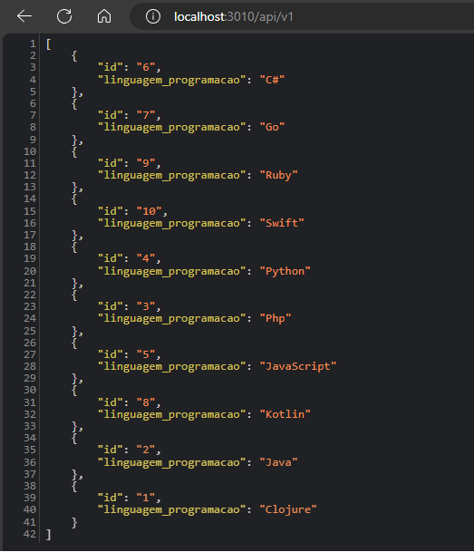

### Desafio - Dockerização

O objetivo deste desafio é criar uma API simples que acesse um banco de dados e retorne uma lista de linguagens de programação. A API e o banco de dados são executados em containers separados, compartilhando a mesma rede no Docker. A partir da API desenvolvida, é criada uma imagem Docker com o arquivo Dockerfile e publicada no Docker Hub.
```bash
docker build -t joaoeduardolima/desafio-fase1-dockerizacao:1.0.0 .
```
 O arquivo docker-compose.yaml contém a orquestração necessária para executar a aplicação.

### Executando a aplicação
Obs: Ter o docker e docker compose instalado.

Passo a Passo
-   1 - Criar um arquivo com o nome docker-compose.yaml e inserir as informações encontradas logo a abaixo em anexo 1.
-   2 - No terminal e no path de onde o arquivo foi criado executar o comando ```docker compose up -d ```
-   3 - No Navegador acessar o link [localhost:3010/api/v1](http://localhost:3010/api/v1)

O resultado esperado é um json com 10 linguagens de programação que foi pré adicionada no banco de dados assim que a aplicação foi executada.



---
anexo 1 - docker-compose.yaml

```yaml
version: '3.8'
services:
  db:
    image: cassandra:5.0
    container_name: db-cassandra
    restart: always
    ports:
      - "9042:9042"
    environment:
      CASSANDRA_CLUSTER_NAME: app
      CASSANDRA_BROADCAST_ADDRESS: host.docker.internal
    networks:
      - app-network
    healthcheck:
      test: ["CMD", "cqlsh", "-e", "DESCRIBE KEYSPACES"]
      interval: 10s
      timeout: 10s
      retries: 10
  
  migrate:
    container_name: migrate
    image: cassandra:5.0
    networks:
      - app-network
    depends_on:
      db:
        condition: service_healthy
    command: >
      bash -c "
      cqlsh db-cassandra -e \"
      CREATE KEYSPACE IF NOT EXISTS app WITH REPLICATION = { 'class' : 'SimpleStrategy', 'replication_factor' : 1 };
      
      CREATE TABLE IF NOT EXISTS app.linguagens_programacao (
          id text,
          linguagem_programacao text,
          PRIMARY KEY (id)
      );
      
      INSERT INTO app.linguagens_programacao (id, linguagem_programacao) VALUES ('1',  'Clojure');
      INSERT INTO app.linguagens_programacao (id, linguagem_programacao) VALUES ('2',  'Java');
      INSERT INTO app.linguagens_programacao (id, linguagem_programacao) VALUES ('3',  'Php');
      INSERT INTO app.linguagens_programacao (id, linguagem_programacao) VALUES ('4',  'Python');
      INSERT INTO app.linguagens_programacao (id, linguagem_programacao) VALUES ('5',  'JavaScript');
      INSERT INTO app.linguagens_programacao (id, linguagem_programacao) VALUES ('6',  'C#');
      INSERT INTO app.linguagens_programacao (id, linguagem_programacao) VALUES ('7',  'Go');
      INSERT INTO app.linguagens_programacao (id, linguagem_programacao) VALUES ('8',  'Kotlin');
      INSERT INTO app.linguagens_programacao (id, linguagem_programacao) VALUES ('9',  'Ruby');
      INSERT INTO app.linguagens_programacao (id, linguagem_programacao) VALUES ('10', 'Swift');
      \"
      "
  
  api:
    container_name: api
    image: joaoeduardolima/desafio-fase1-dockerizacao:1.0.0
    ports:
      - "3010:3010"
    networks:
      - app-network
    depends_on:
      migrate:
        condition: service_started
        
networks:
  app-network:
    driver: bridge
```